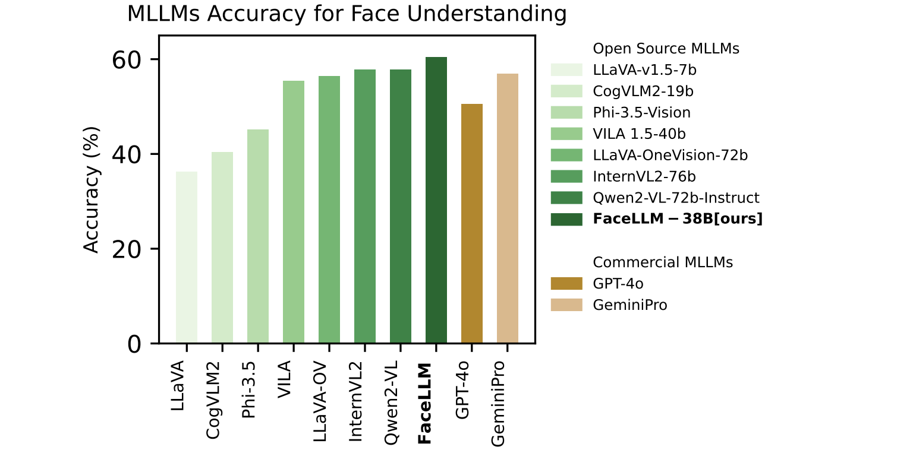
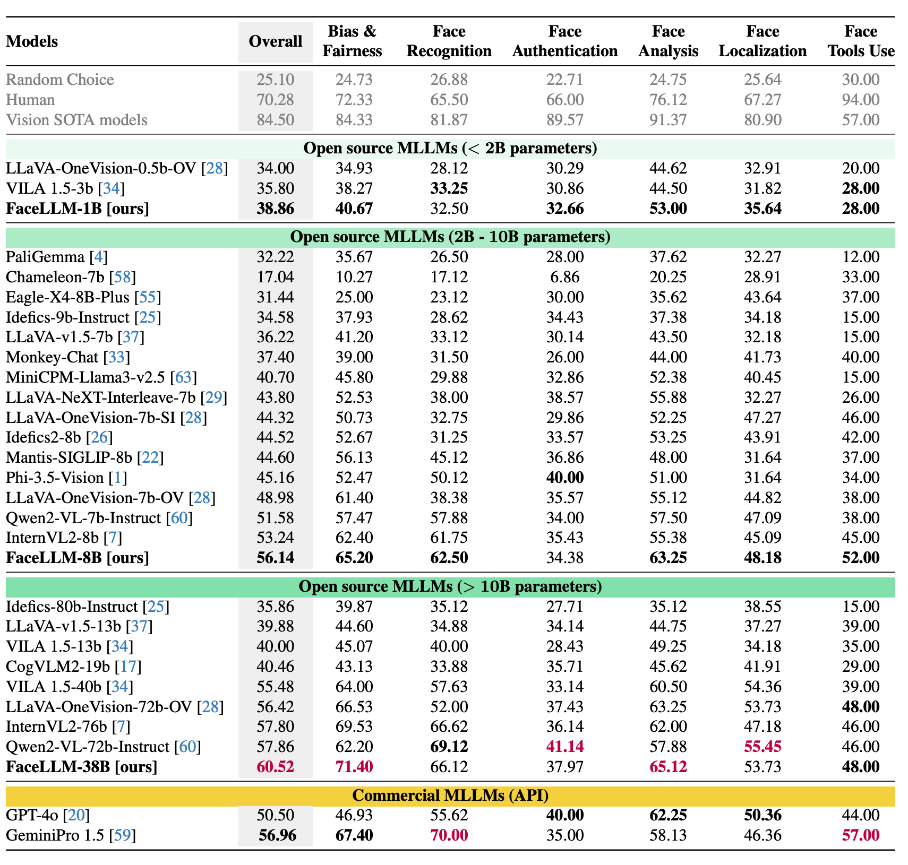
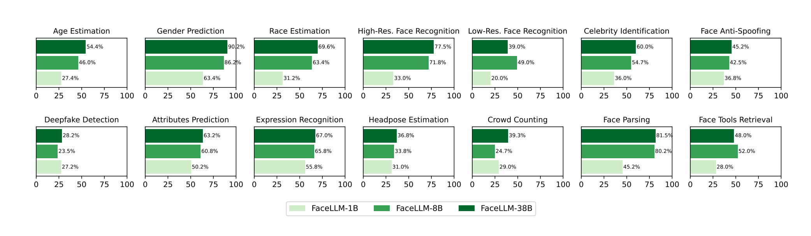

# FaceLLM: A Multimodal Large Language Model for Face Understanding
Multimodal large language models (MLLMs) have shown remarkable performance in vision-language tasks. However, existing MLLMs are primarily trained on generic datasets, limiting their ability to reason on domain-specific visual cues such as those in facial images. In particular, tasks that require detailed understanding of facial structure, expression, emotion, and demographic features remain underexplored by MLLMs due to the lack of large-scale annotated face image-text datasets. In this work, we introduce FaceLLM, a multimodal large language model trained specifically for facial image understanding. Our experiments demonstrate that FaceLLM achieves the state-of-the-art performance of MLLMs on various face-centric tasks. Project page: https://www.idiap.ch/paper/facellm



## Installation
We use [LLaMA-Factory](https://github.com/hiyouga/LLaMA-Factory), [FaceXBench](https://github.com/Kartik-3004/facexbench), [VLMEvalKit](https://github.com/open-compass/VLMEvalKit.git) repositories in our implementation. You can create `facellm` conda environment and install the required dependencies using the following commands: 
```sh
conda create --name facellm  python=3.11

# Install LLaMA-Factory
git clone https://github.com/hiyouga/LLaMA-Factory
cd LLaMA-Factory

conda activate facellm
cd LLaMA-Factory
pip install -r requirements.txt
pip install -e ".[torch,metrics]"


# Install facexbench and VLMEvalKit
cd ..
git clone https://github.com/Kartik-3004/facexbench
git clone https://github.com/open-compass/VLMEvalKit.git

cp facexbench/evaluate.py VLMEvalKit/
cp facexbench/aggregate_results.py VLMEvalKit/

cd VLMEvalKit
pip install -r requirements.txt
pip install -e .
pip install flash-attn --no-build-isolation
```

## FairFaceGPT Dataset
We use FairFaceGPT to train FaceLLM. We provide insutructions to download and preprocess the FairFaceGPT dataset. 

### FairFaceGPT Dataset
FairFaceGPT is a dataset of question-answer pairs generated from the val set of the [FairFace dataset](https://github.com/joojs/fairface) using ChatGPT. It is designed to enhance the understanding of facial images in multimodal large language models (MLLMs). You can generate the dataset with OpenAI API using the following command:

```sh
python fairfacegpt.py
```

**NOTE:** You need to have OpenAI API installed: `pip install openai`. Also, you need to set your OpenAI API key in the `fairfacegpt.py` file.


### Download FairFaceGPT dataset
The dataset is available at [project page](https://www.idiap.ch/paper/facellm). We use `dataset.json` file to train FaceLLM. 


## Train FaceLLM
### Step 1: Prepare the dataset
You need to download the FairFaceGPT dataset and use the provided `dataset.json` file. Then, you need to update `data/dataset_info.json` file in the LLaMA-Factory repository to include the FairFaceGPT dataset. The `dataset_info.json` file in the LLaMA-Factory repository should look like the following:
```json
{
  // Add FairFaceGPT dataset info here
  "fairfacegpt_dataset": {
      "formatting": "sharegpt",
      "file_name": "<path_to_fairfacegpt_dataset_json_file>",
      "columns": {
        "messages": "conversations",
        "image": "image"
      },
      "split": "train",
      "tags": {
        "role_tag": "from",
        "content_tag": "value",
        "user_tag": "human",
        "assistant_tag": "assistant"
      },
      "image_root": "<path_to_fairface_image_directory>"
    },
  // Other datasets
  ...
}
```
You can also use the `data/dataset_info.json` file provided in this repository and replace it with `data/dataset_info.json` file in the LLaMA-Factory repository. 
```sh
cp data/dataset_info.json LLaMA-Factory/data/dataset_info.json
```
We use `FairFace/fairface_img_margin025` for FairFace image directory.


### Step 2: Train FaceLLM (Low Rank Adaptation)
We use LLaMA-Factory to train FaceLLM. The training script is provided in `train.sh` file. You can run the training script using the following command:
```sh
bash train.sh
```
### Step 3: Export FaceLLM
After training, you can export the model using the `llamafactory-cli export` command. 
This will create a directory with the exported model files that can be used for inference or evaluation.
```sh
# export models
llamafactory-cli export \
    --model_name_or_path OpenGVLab/InternVL3-38B-hf \
    --template intern_vl \
    --adapter_name_or_path ./saves/lora/InternVL3-38B-hf/checkpoint-7303 \
    --export_dir ./saves/export/FaceLLM-38B \
    --export_size 1  # Optional: Split model into shards of 1GB each
```
You can also run the `export.sh` script provided in this repository to export the model.
## Run FaceLLM
You can run FaceLLM using the `llamafactory-cli webui` command. This will start a web interface where you can interact with the model. You can also run the `inference.py` script to generate responses from the model:
```sh
python inference.py --path_image <path_to_face_image> --prompt "<your_prompt>"
```

## Evaluate FaceLLM
We use FaceXBench for evaluation of FaceLLM on various face understanding tasks. FaceXBench also uses VLMEvalKit to evaluate MLLMs. Threrefore, we need to integrate FaceLLM into VLMEvalKit and then run FaceXBench. 
### Step 1: Integrate FaceLLM into VLMEvalKit
You need to create a new model configuration file for FaceLLM in the VLMEvalKit repository. To this end you need to make the following changes:
- First, you need to copy the `vlmeval/vlm/facellm.py` file from the current repository to the `vlmeval/vlm/` directory in the VLMEvalKit repository. This file provides the model definition and execution script for the FaceLLM and is used by VLMEvalKit to load the model for evaluation.
```sh
cp vlmeval/vlm/facellm.py VLMEvalKit/vlmeval/vlm/
```
- Second, you need to update `vlmeval/config.py` file in the VLMEvalKit repository to include the FaceLLM model. You can replace the `vlmeval/config.py` file with the one provided in this repository in `vlmeval/config.py`.
```sh
cp vlmeval/config.py VLMEvalKit/vlmeval/config.py
```

### Step 2: Run FaceXBench
After integrating FaceLLM into VLMEvalKit, you can run the evaluation script provided in the `VLMEvalKit` repository. The evaluation script will run FaceXBench on the FaceLLM model and generate the evaluation results.
You can run the evaluation script using the following command:
```sh
python VLMEvalKit/evaluate.py  --model "FaceLLM-38B"
```
After running the evaluation script, you will get the evaluation results as JSON files in the `facexbench/results/` directory. You can also run the following script to get accuracies for different tasks:
```sh
python VLMEvalKit/aggregate_results.py --model FaceLLM-38B --results_dir facexbench/results/FaceLLM-38B
```
This will generate a `results.txt` file in the `facexbench/results/FaceLLM-38B` directory, which contains the accuracies for different tasks and subtasks.
#### Comparison with other models

#### Comparison of different variants of FaceLLM for all sub-tasks


# Reference
If you use this code, FaceLLM models, or the FairFaceGPT dataset, please cite our paper:
```bibtex
  @article{facellm2025,
    author    = {Hatef Otroshi Shahreza and S{\'e}bastien Marcel},
    title     = {FaceLLM: A Multimodal Large Language Model for Face Understanding},
    journal   = {arXiv preprint arXiv:2507.10300},
    year      = {2025}
  }
```